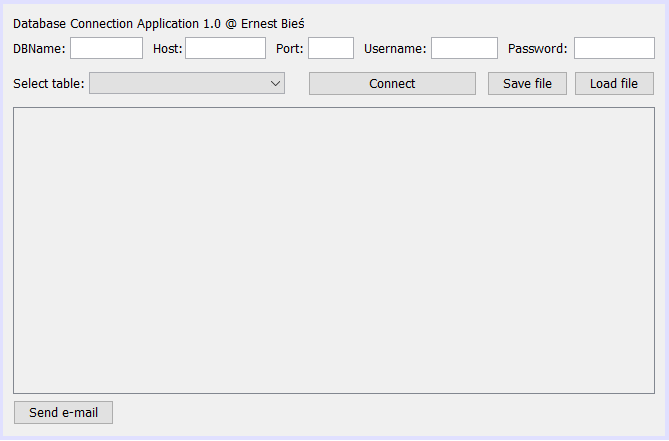
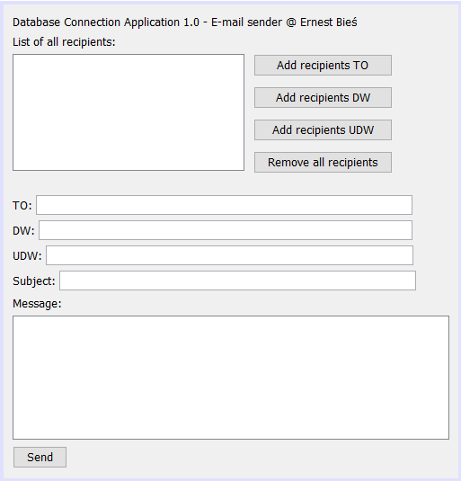

# Database Connection Application
The application allows you to connect to any PostgreSQL database using the JDBC engine. The login data can be saved and read because the application uses serialization. In the application, it is possible to view all tables in the database. If the table contains users' contact details (e-mail address), it is possible to send a message. Sending e-mails is performed by Javax Mail. The user can add recipients (TO, CC, BCC), message subject and content. After approval, the e-mail is sent to the selected users.

# Screenshots

